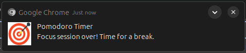

# ⏳ Pomodoro Chrome Extension

A minimal, distraction-free **Pomodoro timer** built as a Chrome Extension. Stay focused, take meaningful breaks, and boost productivity!

## ✅ Features
- 25-minute focus timer
- Start, Pause & Reset controls
- Notification when timer ends
- Time visible directly on extension icon
- Custom durations
- Sounds & alerts
- Pomodoro cycle counter

  
## 📦 How to Use
1. Clone or download this repo
2. Go to `chrome://extensions/`
3. Enable "Developer Mode"
4. Click "Load Unpacked" and select the folder
5. Start using it!

## 📌 Coming Soon
<!-- - Break timers -->
- Setting panel (User preferences)
- Dark Mode toggle
<!-- - Stats dashboard -->

## 🖼️ Images

1. Pomodoro Screen on click of extension

2. Notification on starting of break time and focus time

3. Live timer on badge of extension

## 🧠 Made by [Pranshu Shah](https://www.linkedin.com/in/shahpranshu27/)
